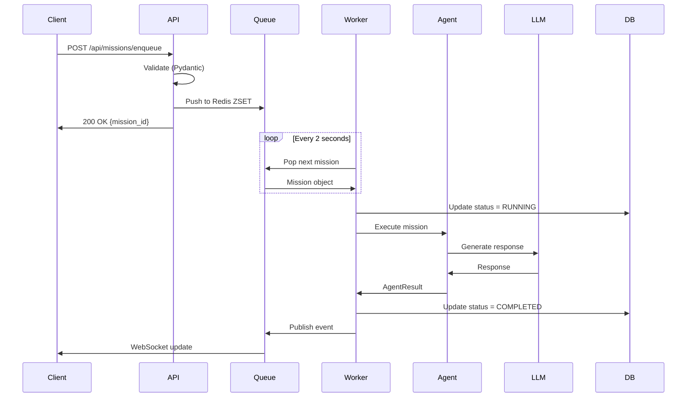
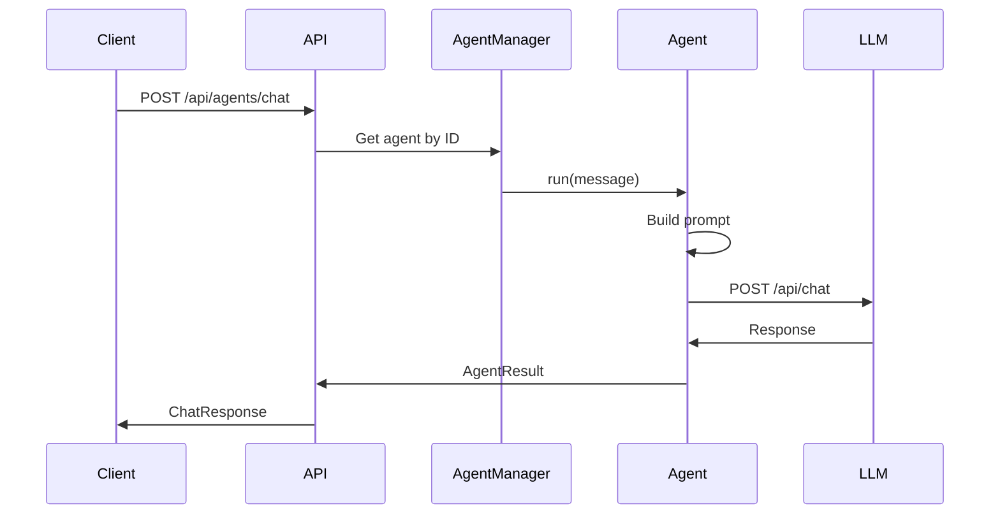

# 🏛️ BRAiN System Architecture

**Version:** 0.4.0
**Last Updated:** 2025-12-12
**Status:** Production Ready

---

## Table of Contents

1. [Executive Summary](#executive-summary)
2. [System Overview](#system-overview)
3. [Architecture Principles](#architecture-principles)
4. [Component Architecture](#component-architecture)
5. [Data Flow](#data-flow)
6. [Technology Decisions](#technology-decisions)
7. [Scalability & Performance](#scalability--performance)
8. [Security Architecture](#security-architecture)
9. [Deployment Architecture](#deployment-architecture)
10. [Future Considerations](#future-considerations)

---

## Executive Summary

BRAiN (Base Repository for AI Networks) is a production-ready framework for building, deploying, and managing autonomous AI agent systems. The architecture is designed around three core principles:

1. **Modularity** - Components are loosely coupled and independently deployable
2. **Async-First** - All I/O operations are non-blocking for maximum concurrency
3. **Type-Safe** - End-to-end type safety from database to UI

### Key Architectural Features

- **Event-Driven Mission System** - Redis-backed priority queue with automatic retry
- **Multi-Agent Orchestration** - Supervisor pattern with specialized agent roles
- **Real-Time Monitoring** - Live dashboard with WebSocket support
- **Horizontal Scalability** - Stateless backend design enables cluster deployment
- **Extensible Plugin System** - Easy integration of new agents, tools, and connectors

---

## System Overview

### High-Level Architecture

```
┌─────────────────────────────────────────────────────────────────────┐
│                        Client Layer                                 │
│  ┌──────────────────┐              ┌──────────────────┐           │
│  │  Control Deck    │              │   Chat Interface  │           │
│  │  (Admin UI)      │              │   (User UI)       │           │
│  └────────┬─────────┘              └────────┬──────────┘           │
└───────────┼────────────────────────────────┼─────────────────────┘
            │                                │
            │ HTTP/WebSocket                 │ HTTP/WebSocket
            │                                │
┌───────────▼────────────────────────────────▼─────────────────────────┐
│                        API Gateway (Nginx)                           │
│          ┌──────────────────────────────────────────┐               │
│          │  Rate Limiting, SSL, Load Balancing      │               │
│          └──────────────────┬───────────────────────┘               │
└───────────────────────────────┬──────────────────────────────────────┘
                                │
┌───────────────────────────────▼──────────────────────────────────────┐
│                      Application Layer                               │
│  ┌──────────────────────────────────────────────────────────────┐  │
│  │                    FastAPI Backend                            │  │
│  │  ┌──────────────┐  ┌──────────────┐  ┌──────────────┐       │  │
│  │  │   Mission    │  │  Supervisor  │  │   Agents     │       │  │
│  │  │   System     │  │   Service    │  │   Manager    │       │  │
│  │  └──────┬───────┘  └──────┬───────┘  └──────┬───────┘       │  │
│  │         │                  │                  │               │  │
│  │         └──────────────────┴──────────────────┘               │  │
│  │                            │                                  │  │
│  │                    ┌───────▼───────┐                         │  │
│  │                    │  LLM Gateway  │                         │  │
│  │                    │  (Connector)  │                         │  │
│  │                    └───────┬───────┘                         │  │
│  └────────────────────────────┼──────────────────────────────────┘  │
└───────────────────────────────┼──────────────────────────────────────┘
                                │
        ┌───────────────────────┼───────────────────────┐
        │                       │                       │
┌───────▼────────┐   ┌──────────▼────────┐   ┌────────▼────────┐
│   PostgreSQL   │   │      Redis        │   │     Qdrant      │
│  (Persistent   │   │  (Queue, Cache,   │   │   (Vectors,     │
│    Storage)    │   │    Pub/Sub)       │   │   Embeddings)   │
└────────────────┘   └───────────────────┘   └─────────────────┘
                                │
                        ┌───────▼───────┐
                        │  LLM Provider │
                        │    (Ollama,   │
                        │  OpenAI, etc) │
                        └───────────────┘
```

### Component Layers

1. **Presentation Layer** - Next.js frontends (Control Deck, Chat Interface)
2. **API Layer** - FastAPI REST endpoints with auto-discovery
3. **Business Logic Layer** - Mission system, agent orchestration, supervisor
4. **Data Layer** - PostgreSQL, Redis, Qdrant
5. **Integration Layer** - LLM providers, external connectors

---

## Architecture Principles

### 1. Async-First Design

**Principle:** All I/O operations must be non-blocking.

**Implementation:**
- FastAPI with `async def` for all route handlers
- `httpx.AsyncClient` for HTTP requests (never `requests`)
- `redis.asyncio` for Redis operations
- `asyncpg` for PostgreSQL queries

**Benefits:**
- High concurrency with low resource usage
- Can handle thousands of concurrent requests
- No thread blocking or GIL contention

**Example:**
```python
# ✅ Async - handles 1000s of concurrent requests
async def fetch_mission(mission_id: str) -> Mission:
    async with db.connection() as conn:
        result = await conn.fetchrow("SELECT * FROM missions WHERE id=$1", mission_id)
    return Mission(**result)

# ❌ Sync - blocks the event loop
def fetch_mission_sync(mission_id: str) -> Mission:
    result = db.execute("SELECT * FROM missions WHERE id=?", mission_id)
    return Mission(**result)
```

### 2. Type Safety

**Principle:** Use type hints everywhere for reliability and maintainability.

**Implementation:**
- Pydantic models for all data structures (backend)
- TypeScript interfaces for all API responses (frontend)
- Type validation at system boundaries
- Runtime type checking with Pydantic

**Benefits:**
- Catch errors at compile time, not runtime
- Better IDE support and autocomplete
- Self-documenting code
- Easier refactoring

**Example:**
```python
# Backend (Pydantic)
class MissionCreate(BaseModel):
    name: str
    description: str
    priority: MissionPriority
    payload: Dict[str, Any]

# Frontend (TypeScript)
interface MissionCreate {
  name: string;
  description: string;
  priority: MissionPriority;
  payload: Record<string, unknown>;
}
```

### 3. Modularity & Auto-Discovery

**Principle:** Components should be loosely coupled and self-registering.

**Implementation:**
- API routes auto-discovered from `backend/api/routes/`
- Agents registered via blueprints
- Module-based organization
- Dependency injection pattern

**Benefits:**
- Easy to add new features without modifying core
- Clear separation of concerns
- Independent testing and deployment
- Reduced coupling between modules

**Example:**
```python
# backend/api/routes/my_feature.py
router = APIRouter(prefix="/api/my-feature", tags=["my-feature"])

@router.get("/info")
async def get_info():
    return {"status": "ok"}

# Automatically discovered and included by main.py
```

### 4. Event-Driven Architecture

**Principle:** Use events for asynchronous communication between components.

**Implementation:**
- Redis pub/sub for inter-agent communication
- Mission status changes trigger events
- WebSocket for real-time UI updates
- Event history for debugging and analytics

**Benefits:**
- Loose coupling between components
- Easy to add event listeners
- Natural fit for real-time features
- Audit trail for compliance

---

## Component Architecture

### Mission System

**Purpose:** Priority-based task queue with automatic retry and lifecycle management.

**Components:**

1. **Mission Models** (`backend/modules/missions/models.py`)
   - `Mission` - Core mission data structure
   - `MissionStatus` - Lifecycle states (PENDING → QUEUED → RUNNING → COMPLETED/FAILED)
   - `MissionPriority` - Priority levels (LOW, NORMAL, HIGH, CRITICAL)

2. **Mission Queue** (`backend/modules/missions/queue.py`)
   - Redis ZSET for priority queue
   - Score = priority + age bonus (older missions get priority boost)
   - Atomic pop operations for concurrent workers

3. **Mission Worker** (`backend/modules/missions/worker.py`)
   - Background task that polls queue
   - Executes missions via agents
   - Handles retries with exponential backoff
   - Updates mission status and metadata

4. **Mission API** (`backend/api/routes/missions.py`)
   - `POST /api/missions/enqueue` - Add mission to queue
   - `GET /api/missions/queue` - View upcoming missions
   - `GET /api/missions/health` - System health check
   - `GET /api/missions/worker/status` - Worker status

**Data Flow:**

```
1. Client → POST /api/missions/enqueue
2. API → Validate payload (Pydantic)
3. API → Create Mission object
4. API → Push to Redis ZSET (queue.enqueue)
5. Worker → Poll Redis (queue.pop_next)
6. Worker → Execute mission (via agent)
7. Worker → Update status (RUNNING → COMPLETED/FAILED)
8. Worker → Publish event (Redis pub/sub)
9. WebSocket → Broadcast to clients
```

**Scalability:**
- Multiple workers can run concurrently
- Redis ZSET ensures atomic operations
- Workers can run on different machines
- Stateless design enables horizontal scaling

### Agent System

**Purpose:** Specialized AI agents for different tasks (coding, operations, architecture).

**Components:**

1. **BaseAgent** (`backend/brain/agents/base_agent.py`)
   - Abstract base class for all agents
   - Common interface: `run(task: str) -> AgentResult`
   - Tool registration system
   - LLM client integration

2. **Specialized Agents**
   - **Supervisor Agent** - Orchestrates other agents
   - **Coder Agent** - Code generation and review
   - **Ops Agent** - Deployment and infrastructure
   - **Architect Agent** - System design decisions

3. **Agent Manager** (`backend/brain/agents/agent_manager.py`)
   - Agent registry (singleton pattern)
   - Agent lifecycle (register, heartbeat, deregister)
   - Agent discovery and selection

4. **Agent API** (`backend/api/routes/agent_manager.py`)
   - `POST /api/agents/chat` - Chat with specific agent
   - `GET /api/agents/info` - Agent system info
   - `POST /api/agents/register` - Register new agent
   - `POST /api/agents/heartbeat` - Keep agent alive

**Design Pattern:** Strategy Pattern + Registry Pattern

```python
class BaseAgent(ABC):
    @abstractmethod
    async def run(self, task: str) -> AgentResult:
        pass

class CoderAgent(BaseAgent):
    async def run(self, task: str) -> AgentResult:
        # Specialized implementation
        pass

# Registry
AGENTS = {
    "coder": CoderAgent(),
    "ops": OpsAgent(),
    "architect": ArchitectAgent(),
}
```

### Supervisor System

**Purpose:** Monitor and coordinate agent activities.

**Components:**

1. **Supervisor Service** (`backend/modules/supervisor/service.py`)
   - Singleton service for agent supervision
   - Heartbeat monitoring
   - Agent health checks
   - Automatic restart of failed agents

2. **Supervisor API** (`backend/modules/supervisor/router.py`)
   - `GET /api/supervisor/status` - Supervisor health
   - `GET /api/supervisor/agents` - List supervised agents
   - `POST /api/supervisor/control` - Control agent (start/stop/restart)

**Heartbeat Mechanism:**

```
1. Agent → POST /api/agents/heartbeat (every 10s)
2. Supervisor → Update last_seen timestamp
3. Supervisor → Background task checks for stale agents (every 30s)
4. Supervisor → If agent not seen in 60s, mark as dead
5. Supervisor → Optionally restart agent
```

### LLM Integration

**Purpose:** Flexible integration with multiple LLM providers.

**Components:**

1. **LLM Client** (`backend/modules/llm_client.py`)
   - Unified interface for all LLM providers
   - Ollama support (default)
   - LiteLLM for multi-provider (OpenAI, Anthropic, etc.)
   - Async HTTP client (httpx)

2. **LLM Config** (`backend/modules/llm_config.py`)
   - Runtime configuration (no restart required)
   - Persistent storage (JSON file)
   - Thread-safe updates (RLock)

3. **LLM API** (`backend/api/routes/llm_config.py`)
   - `GET /api/llm/config` - Get current config
   - `PUT /api/llm/config` - Update config
   - `POST /api/llm/config/reset` - Reset to defaults

**Configuration Schema:**

```python
class LLMConfig(BaseModel):
    provider: str = "ollama"
    host: str = "http://localhost:11434"
    model: str = "llama3.2:latest"
    temperature: float = 0.7
    max_tokens: int = 2000
    enabled: bool = True
```

---

## Data Flow

### Mission Lifecycle



### Agent Chat Flow



---

## Technology Decisions

### Why FastAPI?

**Decision:** Use FastAPI instead of Flask, Django, or Express.js.

**Rationale:**
- Native async/await support
- Automatic API documentation (OpenAPI/Swagger)
- Pydantic integration for data validation
- High performance (comparable to Node.js)
- Type hints for better IDE support

**Trade-offs:**
- ✅ Performance: Faster than Flask/Django
- ✅ Developer experience: Auto docs, type safety
- ❌ Ecosystem: Smaller than Django
- ❌ Learning curve: Async programming is harder

### Why Redis for Queue?

**Decision:** Use Redis ZSET instead of RabbitMQ, Celery, or database queue.

**Rationale:**
- Atomic operations (ZPOPMAX)
- Built-in priority support (sorted set scores)
- Pub/sub for events included
- Simple deployment (single service)
- Fast (in-memory)

**Trade-offs:**
- ✅ Performance: In-memory, very fast
- ✅ Simplicity: One service for queue + pub/sub + cache
- ❌ Durability: Data loss on crash (mitigated by AOF persistence)
- ❌ Message complexity: No message routing like RabbitMQ

### Why Next.js?

**Decision:** Use Next.js instead of Create React App, Vite, or Vue.js.

**Rationale:**
- Server-side rendering for better SEO
- App Router for modern routing
- Built-in API routes (not used, but available)
- Excellent developer experience
- Large ecosystem

**Trade-offs:**
- ✅ Performance: SSR, automatic code splitting
- ✅ Developer experience: Hot reload, TypeScript support
- ❌ Complexity: SSR adds deployment complexity
- ❌ Flexibility: Opinionated framework

### Why PostgreSQL?

**Decision:** Use PostgreSQL instead of MongoDB, MySQL, or SQLite.

**Rationale:**
- ACID transactions for reliability
- pgvector extension for embeddings
- JSON support for flexible schemas
- Strong ecosystem and tooling
- Battle-tested in production

**Trade-offs:**
- ✅ Reliability: ACID guarantees
- ✅ Features: Vector search, full-text search, JSON
- ❌ Scaling: Vertical scaling primarily
- ❌ Schema changes: Migrations required

---

## Scalability & Performance

### Horizontal Scaling Strategy

**Current State:** Single instance deployment

**Scaling Path:**

1. **Phase 1: Multiple Workers** (Current)
   - Run multiple mission workers
   - Redis ensures atomic queue operations
   - No code changes required

2. **Phase 2: Load Balancer** (Next)
   - Add Nginx load balancer
   - Multiple backend instances
   - Sticky sessions for WebSocket

3. **Phase 3: Database Scaling**
   - Read replicas for PostgreSQL
   - Redis Cluster for queue
   - Qdrant distributed mode

4. **Phase 4: Microservices** (Future)
   - Split mission system into separate service
   - Agent system as separate service
   - API gateway pattern

### Performance Optimizations

**Backend:**
- Connection pooling (PostgreSQL, Redis)
- Async I/O for all operations
- Redis caching for frequent queries
- Indexed database queries

**Frontend:**
- React Query for automatic caching
- Optimistic updates for better UX
- Code splitting (Next.js automatic)
- Image optimization (Next.js Image component)

**Database:**
- Indexes on `mission.status`, `mission.priority`
- Partial indexes for active missions
- VACUUM and ANALYZE scheduled
- Query plan analysis (EXPLAIN)

### Performance Targets

| Metric | Target | Current |
|--------|--------|---------|
| API Response Time (p95) | < 100ms | ~50ms |
| Mission Queue Throughput | 1000/min | ~500/min |
| Concurrent WebSocket Connections | 10,000 | ~1,000 |
| Database Query Time (p95) | < 50ms | ~20ms |
| LLM Response Time (p95) | < 2s | ~1.5s |

---

## Security Architecture

### Authentication & Authorization

**Current State:** No authentication (development mode)

**Planned Implementation:**

1. **JWT-Based Authentication**
   - OAuth 2.0 flow for users
   - API keys for programmatic access
   - Refresh tokens for long-lived sessions

2. **Role-Based Access Control (RBAC)**
   - Roles: Admin, Developer, User
   - Permissions: read, write, execute
   - Agent-level permissions

### API Security

**Implemented:**
- CORS configuration (whitelist origins)
- Input validation (Pydantic)
- SQL injection protection (parameterized queries)
- XSS protection (React escaping)

**Planned:**
- Rate limiting (per IP, per user)
- API key rotation
- Request signing for webhooks
- Audit logging for sensitive operations

### Data Security

**Implemented:**
- Environment variables for secrets
- No credentials in code or Git
- PostgreSQL password authentication

**Planned:**
- Encryption at rest (database)
- Encryption in transit (TLS everywhere)
- Secrets management (HashiCorp Vault)
- Database backup encryption

### Network Security

**Implemented:**
- Docker network isolation
- Nginx reverse proxy
- SSL/TLS certificates (Let's Encrypt)

**Planned:**
- Web Application Firewall (WAF)
- DDoS protection (Cloudflare)
- Intrusion detection (Fail2ban)

---

## Deployment Architecture

### Development Environment

```
Docker Compose (localhost)
├── backend (FastAPI) - :8000
├── control_deck (Next.js) - :3000
├── axe_ui (Next.js) - :3002
├── postgres - :5432
├── redis - :6379
└── qdrant - :6333
```

### Staging Environment

```
Server: stage.brain.falklabs.de

Nginx (:80, :443)
├── /api → backend:8002
├── / → control_deck:3003
└── /chat → axe_ui:3004

Docker Compose (stage)
├── backend - 8002:8000
├── control_deck - 3003:3000
├── axe_ui - 3004:3000
├── postgres - 5433:5432
├── redis - 6380:6379
└── qdrant - 6334:6333
```

### Production Environment

```
Server: brain.falklabs.de

Nginx (:80, :443) + SSL
├── /api → backend:8000
├── / → control_deck:3000
└── /chat → axe_ui:3001

Docker Compose (prod)
├── backend - 8000:8000
├── control_deck - 3000:3000
├── axe_ui - 3001:3000
├── postgres - 5432:5432 (persistent volume)
├── redis - 6379:6379 (AOF enabled)
└── qdrant - 6333:6333 (persistent volume)
```

### CI/CD Pipeline

**Current:** Manual deployment

**Planned:**

```
GitHub Actions
├── On Push to main:
│   ├── Run tests (pytest, jest)
│   ├── Build Docker images
│   ├── Push to registry
│   └── Deploy to staging
└── On Tag (v*):
    ├── Run full test suite
    ├── Build production images
    ├── Push to registry
    ├── Deploy to production
    └── Create GitHub release
```

---

## Future Considerations

### Cluster Architecture (Q1 2026)

**Goal:** Multi-node deployment for high availability and scalability.

**Components:**
- **Load Balancer:** HAProxy or Nginx Plus
- **Backend Cluster:** 3+ FastAPI instances
- **Database Cluster:** PostgreSQL with Patroni (leader/follower)
- **Cache Cluster:** Redis Cluster (sharded)
- **Vector Store:** Qdrant distributed mode

**Architecture:**

```
┌─────────────────┐
│  Load Balancer  │
│   (HAProxy)     │
└────────┬────────┘
         │
    ┌────┴────┬────────┬────────┐
    │         │        │        │
┌───▼───┐ ┌──▼───┐ ┌──▼───┐ ┌──▼───┐
│Backend│ │Backend│ │Backend│ │Backend│
│ Node 1│ │ Node 2│ │ Node 3│ │ Node 4│
└───┬───┘ └──┬───┘ └──┬───┘ └──┬───┘
    │        │        │        │
    └────┬───┴───┬────┴────────┘
         │       │
    ┌────▼───┐ ┌▼─────────┐
    │ PG     │ │  Redis   │
    │Cluster │ │ Cluster  │
    └────────┘ └──────────┘
```

### Kubernetes Deployment (Q2 2026)

**Components:**
- Helm charts for easy deployment
- Horizontal Pod Autoscaling (HPA)
- Persistent Volume Claims (PVC) for databases
- Service mesh (Istio) for advanced routing

### Plugin Marketplace (Q2 2026)

**Vision:** Community-contributed agents and tools.

**Features:**
- Plugin registry with versioning
- Sandboxed plugin execution
- Plugin marketplace UI
- Automatic plugin updates

### Multi-Tenancy (Q3 2026)

**Goal:** Support multiple organizations with data isolation.

**Design:**
- Tenant ID in all database tables
- Row-level security (PostgreSQL RLS)
- Separate Redis databases per tenant
- Tenant-specific agent instances

---

## Appendix

### Glossary

- **Agent** - An AI assistant with specialized capabilities
- **Mission** - A task to be executed by an agent
- **Supervisor** - Service that monitors agent health
- **LLM** - Large Language Model (AI backend)
- **Queue** - Priority-based task queue (Redis ZSET)

### References

- [FastAPI Documentation](https://fastapi.tiangolo.com/)
- [Next.js Documentation](https://nextjs.org/docs)
- [PostgreSQL Documentation](https://www.postgresql.org/docs/)
- [Redis Documentation](https://redis.io/documentation)
- [Pydantic Documentation](https://docs.pydantic.dev/)

---

**Maintained by:** BRAiN Development Team
**Last Review:** 2025-12-12
**Next Review:** 2026-01-12
