# BRAiN Target Architecture

Agentic Operating System with Skills as Core Runtime

```text
                          BRAiN TARGET ARCHITECTURE
               Agentic Operating System with Skills as Core Runtime


┌──────────────────────────────────────────────────────────────────────────────────────────────────────────┐
│  6. WORLD INTERFACE & BUILDERS                                                                          │
│                                                                                                          │
│  Artifact / Builder Layer                           Domain Builder / World Adapter Layer                 │
│  ┌──────────────────────────────┐                   ┌─────────────────────────────────────────────────┐  │
│  │ template_registry            │                   │ webgenesis                                     │  │
│  │ template_engine              │                   │ course_factory                                 │  │
│  │ artifact_factory             │                   │ dashboard_builder                              │  │
│  │ build_executor               │                   │ workflow_builder                               │  │
│  │ exporters / packagers        │                   │ connectors / tools                             │  │
│  └──────────────────────────────┘                   │ deployment / dns_hetzner / coolify            │  │
│                                                     │ physical_gateway / ros2 / vision / slam       │  │
│                                                     │ fleet / infra agents                           │  │
│                                                     └─────────────────────────────────────────────────┘  │
└──────────────────────────────────────────────────────────────────────────────────────────────────────────┘
                                                 ▲
                                                 │ produces artifacts / controls systems
                                                 │
┌──────────────────────────────────────────────────────────────────────────────────────────────────────────┐
│  5. MEMORY & EVOLUTION                                                                                  │
│                                                                                                          │
│  ┌──────────────────────────────┐   ┌──────────────────────────────┐   ┌──────────────────────────────┐ │
│  │ episodic_memory              │   │ semantic_memory              │   │ procedural_memory            │ │
│  │ execution_history            │   │ knowledge_graph              │   │ provider_history             │ │
│  │ evaluation_history           │   │ cost_history                 │   │ quality_history              │ │
│  └──────────────────────────────┘   └──────────────────────────────┘   └──────────────────────────────┘ │
│                                                                                                          │
│  ┌──────────────────────────────┐   ┌──────────────────────────────┐   ┌──────────────────────────────┐ │
│  │ learning                     │   │ optimizer                    │   │ karma                        │ │
│  │ genesis                      │   │ dna                          │   │ genetic_integrity            │ │
│  │ mutation / varianting        │   │ lineage                      │   │ quarantine                   │ │
│  └──────────────────────────────┘   └──────────────────────────────┘   └──────────────────────────────┘ │
└──────────────────────────────────────────────────────────────────────────────────────────────────────────┘
                                                 ▲
                                                 │ stores traces / learns / evolves
                                                 │
┌──────────────────────────────────────────────────────────────────────────────────────────────────────────┐
│  4. AGENTS & ORCHESTRATION                                                                              │
│                                                                                                          │
│  ┌──────────────────────────────┐   ┌──────────────────────────────┐   ┌──────────────────────────────┐ │
│  │ agent_management             │   │ supervisor                   │   │ mission_control              │ │
│  │ agent_identity               │   │ policy-aware coordination    │   │ mission runtime              │ │
│  │ lifecycle                    │   │ escalation / approval        │   │ mission templates            │ │
│  └──────────────────────────────┘   └──────────────────────────────┘   └──────────────────────────────┘ │
│                                                                                                          │
│  ┌──────────────────────────────┐   ┌──────────────────────────────┐   ┌──────────────────────────────┐ │
│  │ planning                     │   │ orchestrator                 │   │ autonomous_pipeline          │ │
│  │ task_queue                   │   │ delegation                   │   │ controlled execution flows   │ │
│  │ workload routing             │   │ multi-agent coordination     │   │ retries / checkpoints        │ │
│  └──────────────────────────────┘   └──────────────────────────────┘   └──────────────────────────────┘ │
│                                                                                                          │
│                      Agents do not contain business logic.                                               │
│                      Agents select, invoke, supervise skills.                                            │
└──────────────────────────────────────────────────────────────────────────────────────────────────────────┘
                                                 ▲
                                                 │ requests skill runs / receives results
                                                 │
┌──────────────────────────────────────────────────────────────────────────────────────────────────────────┐
│  3. SKILL SYSTEM                                                                                        │
│                                                                                                          │
│  Skill Definition Layer                                                                                  │
│  ┌──────────────────────────────────────────────────────────────────────────────────────────────────────┐ │
│  │ skill_id / purpose / inputs / outputs / required_capabilities / optional_capabilities              │ │
│  │ constraints / quality_profile / fallback_policy / output_format / evaluation_criteria              │ │
│  └──────────────────────────────────────────────────────────────────────────────────────────────────────┘ │
│                                                                                                          │
│  Skill Engine                                                                                            │
│  ┌──────────────┐   ┌──────────────┐   ┌──────────────┐   ┌──────────────┐   ┌──────────────┐          │
│  │ skill        │-> │ skill        │-> │ skill        │-> │ capability   │-> │ execution    │          │
│  │ selector     │   │ registry     │   │ planner      │   │ resolver     │   │ engine       │          │
│  └──────────────┘   └──────────────┘   └──────────────┘   └──────────────┘   └──────────────┘          │
│                                                                                                          │
│                                  ┌──────────────┐   ┌──────────────┐   ┌──────────────┐                │
│                                  │ evaluator    │-> │ optimizer    │-> │ telemetry     │                │
│                                  └──────────────┘   └──────────────┘   └──────────────┘                │
│                                                                                                          │
│                      Skill Creator builds skills.                                                        │
│                      Skill Engine runs, evaluates, and evolves them.                                    │
└──────────────────────────────────────────────────────────────────────────────────────────────────────────┘
                                                 ▲
                                                 │ resolves into atomic abilities
                                                 │
┌──────────────────────────────────────────────────────────────────────────────────────────────────────────┐
│  2. CAPABILITY SUBSTRATE                                                                                │
│                                                                                                          │
│  Capability Domains                                                                                      │
│  ┌──────────────────────────────┐   ┌──────────────────────────────┐   ┌──────────────────────────────┐ │
│  │ perception                   │   │ reasoning                    │   │ generation                   │ │
│  │ research.web.search          │   │ classify                     │   │ text.generate                │ │
│  │ docs.read                    │   │ rank                         │   │ image.generate               │ │
│  │ logs.inspect                 │   │ compare                      │   │ video.generate               │ │
│  └──────────────────────────────┘   └──────────────────────────────┘   └──────────────────────────────┘ │
│                                                                                                          │
│  ┌──────────────────────────────┐   ┌──────────────────────────────┐   ┌──────────────────────────────┐ │
│  │ code                         │   │ execution                    │   │ infra                        │ │
│  │ code.debug                   │   │ tool.invoke                  │   │ deploy.coolify               │ │
│  │ code.refactor                │   │ workflow.step                │   │ infra.hetzner_dns_update    │ │
│  │ code.test                    │   │ publish.web                  │   │ service.restart              │ │
│  └──────────────────────────────┘   └──────────────────────────────┘   └──────────────────────────────┘ │
│                                                                                                          │
│  Each capability has:                                                                                   │
│  - provider bindings                                                                                    │
│  - cost profile                                                                                         │
│  - availability                                                                                         │
│  - quality metrics                                                                                      │
│  - fallback options                                                                                     │
└──────────────────────────────────────────────────────────────────────────────────────────────────────────┘
                                                 ▲
                                                 │ governed and protected by
                                                 │
┌──────────────────────────────────────────────────────────────────────────────────────────────────────────┐
│  1. CONSTITUTION CORE                                                                                   │
│                                                                                                          │
│  ┌──────────────────────────────┐   ┌──────────────────────────────┐   ┌──────────────────────────────┐ │
│  │ auth / identity              │   │ policy / governance          │   │ audit / compliance           │ │
│  │ permissions                  │   │ sovereign_mode               │   │ traceability                 │ │
│  │ trust tiers                  │   │ action approval              │   │ event contracts              │ │
│  └──────────────────────────────┘   └──────────────────────────────┘   └──────────────────────────────┘ │
│                                                                                                          │
│  ┌──────────────────────────────┐   ┌──────────────────────────────┐   ┌──────────────────────────────┐ │
│  │ config / secrets             │   │ module_registry              │   │ service_registry             │ │
│  │ token keys                   │   │ state model                  │   │ health model                 │ │
│  │ rate limits                  │   │ allowed modules              │   │ runtime status               │ │
│  └──────────────────────────────┘   └──────────────────────────────┘   └──────────────────────────────┘ │
│                                                                                                          │
│                     No skill, agent, tool, or builder bypasses this layer.                              │
└──────────────────────────────────────────────────────────────────────────────────────────────────────────┘
```

## Primary BRAiN Runtime Flow

```text
User / Agent Intent
        │
        ▼
┌─────────────────┐
│ Intent Routing  │
└─────────────────┘
        │
        ▼
┌─────────────────┐
│ Skill Selector  │
└─────────────────┘
        │
        ▼
┌─────────────────┐
│ Skill Planner   │
└─────────────────┘
        │
        ▼
┌─────────────────┐
│ Capability      │
│ Resolver        │
└─────────────────┘
        │
        ▼
┌─────────────────┐
│ Execution       │
│ Engine          │
└─────────────────┘
        │
 ┌──────┴──────┐
 │             │
 ▼             ▼
┌─────────────┐  ┌─────────────┐
│ Evaluator   │  │ Memory      │
└─────────────┘  └─────────────┘
      │             │
      └──────┬──────┘
             ▼
     ┌─────────────────┐
     │ Optimizer       │
     └─────────────────┘
             │
             ▼
improved skill version / provider strategy / execution policy
```

## Mermaid Flowchart

```mermaid
flowchart TB
    U[User / Agent Request] --> IR[Intent Routing]
    IR --> SS[Skill Selector]
    SS --> SP[Skill Planner]
    SP --> CR[Capability Resolver]
    CR --> EE[Execution Engine]
    EE --> EV[Evaluator]
    EE --> MEM[Memory]
    EV --> OPT[Optimizer]
    MEM --> OPT
    OPT --> SV[Improved Skill Version / Provider Strategy / Execution Policy]

    subgraph L1[1. Constitution Core]
        AUTH[Auth / Identity]
        GOV[Policy / Governance]
        AUDIT[Audit / Compliance]
        CFG[Config / Secrets]
        REG[Module + Service Registry]
        HEALTH[State / Health Model]
    end

    subgraph L2[2. Capability Substrate]
        CAP1[Perception]
        CAP2[Reasoning]
        CAP3[Generation]
        CAP4[Code]
        CAP5[Execution]
        CAP6[Infra]
    end

    subgraph L3[3. Skill System]
        DEF[Skill Definitions]
        REGS[Skill Registry]
        SEL[Skill Selector]
        PLAN[Skill Planner]
        RES[Capability Resolver]
        EXEC[Execution Engine]
        EVAL[Evaluator]
        TELE[Telemetry]
        OPM[Optimizer]
    end

    subgraph L4[4. Agents & Orchestration]
        AGM[Agent Management]
        SUP[Supervisor]
        MIS[Mission Control]
        ORCH[Orchestrator]
        TQ[Task Queue]
        AP[Autonomous Pipeline]
    end

    subgraph L5[5. Memory & Evolution]
        EPI[Episodic Memory]
        SEM[Semantic Memory]
        PROC[Procedural Memory]
        LEARN[Learning]
        DNA[DNA / Lineage]
        GEN[Genesis]
        KARMA[Karma]
        GI[Genetic Integrity]
        Q[Quarantine]
    end

    subgraph L6[6. World Interface & Builders]
        TEMP[Template Registry / Engine]
        AF[Artifact Factory]
        BE[Build Executor]
        WG[WebGenesis]
        CF[Course Factory]
        DB[Dashboard Builder]
        WF[Workflow Builder]
        DEP[Deployment / DNS / Coolify]
        PHY[Physical Gateway / ROS2 / Vision / SLAM / Fleet]
    end

    L1 --> L2
    L1 --> L3
    L1 --> L4
    L1 --> L5
    L1 --> L6

    L2 --> L3
    L3 --> L4
    L4 --> L5
    L5 --> L3
    L4 --> L6
    L3 --> L6
```


