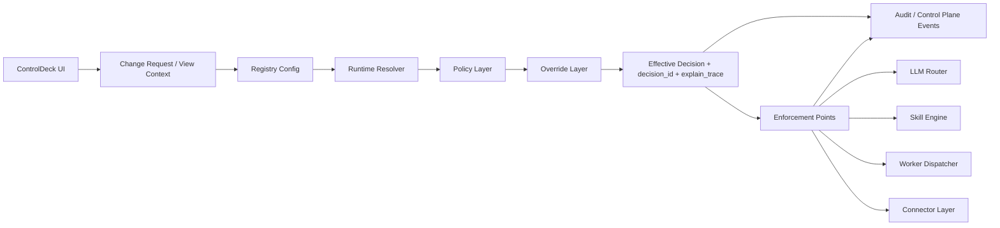

# ControlDeck -> Runtime Config / Policy Layer (Slice-Ready)

Status: In implementation (Resolver + Enforcement + CR/Approval + Registry Promotion + Timeline baseline)

## A. Ist-Zustand

- **Vorhandene Bausteine**
  - `backend/app/modules/config_management/*`: zentrale Config-/Vault-Verwaltung, inklusive Audit-Bridge und Rotation-Flows.
  - `backend/app/modules/policy/*`: Policy-Engine mit Evaluierung und API (`/api/policy/evaluate`).
  - `backend/app/core/authorization_engine.py`: Sicherheitskritische AuthZ-Entscheidungen mit Policy-Integration und Approval-Hooks.
  - `backend/app/modules/provider_bindings/*`, `backend/app/modules/provider_portal/*`: provider-/capability-nahe Control-Plane-Pfade mit Events/Audit.
  - `backend/app/modules/safe_mode/*`: globales Emergency-/Kill-Switch-Verhalten.
  - `frontend/controldeck-v3/src/app/(protected)/settings/page.tsx`: Config-Vault-UI als bestehender ControlDeck-Einstieg.

- **Luecken / Mismatches**
  - Kein einheitlicher Runtime-Resolver fuer effektive Laufzeitentscheidungen ueber Module hinweg.
  - Override-Logik ist verteilt (Safe Mode, Governor, Modul-Defaults), aber nicht als First-Class Override-Hierarchie gebuendelt.
  - Explainability ist inkonsistent: teilweise Audit vorhanden, aber keine standardisierte `decision_id + explain_trace` fuer Runtime-Pfade.
  - ControlDeck ist derzeit eher Config-UI; Effective Runtime Decision View fehlt als durchgaengiges Objekt.

- **Risiken**
  - Drift zwischen UI-Eingaben, Service-Laufzeitverhalten und Policy-Entscheidungen.
  - Fehlende zentrale Prioritaetslogik fuer Overrides -> schwer debugbar in Incident-Lagen.
  - Erhoehte Governance-Risiken bei verteilten Mutationspfaden ohne konsistente Decision Chain.

## B. Zielarchitektur

- **Kernfluss (kanonisch)**
  - `Registry -> Resolver -> Policy -> Override -> Enforcement -> Audit`

- **Verantwortlichkeiten**
  - **Registry**: versionierte Basiskonfigurationen (tenant/environment/mission-spezifisch).
  - **Resolver**: berechnet effektive Entscheidung und erzeugt `decision_id`, `effective_config`, `explain_trace`.
  - **Policy Layer**: bewertet Risiko/Governance/Budget-Kontext; liefert policy-derived constraints.
  - **Override Layer**: Emergency/Governor/Manual/Feature-Overrides mit fester Prioritaet.
  - **Enforcement Points**: erzwingen effektive Entscheidung in LLM-, Worker-, SkillRun- und Connector-Pfaden.
  - **Audit Layer**: persistiert reason chain, actor, approver, correlation ids, applied policies/overrides.

- **ControlDeck Rolle**
  - Steuer- und Sichtschicht auf diese Control-Plane.
  - Nicht Source-of-Truth und keine verstreuten Direktschreibpfade.

## C. Konkretes Domain Model

- **Namespaces (Runtime Config Taxonomie)**
  - `routing.*` (z. B. `routing.llm.default_provider`, `routing.llm.allowed_providers`)
  - `workers.*` (z. B. `workers.selection.default_executor`, `workers.selection.allowed_executors`)
  - `budgets.*` (z. B. `budgets.skillrun.credit_limit`, `budgets.skillrun.soft_stop_threshold`)
  - `limits.*` (z. B. `limits.parallel.max_worker_tasks`)
  - `timeouts.*` (z. B. `timeouts.skillrun.default_seconds`)
  - `governance.*` (z. B. `governance.approval_required`)
  - `security.*` (z. B. `security.allowed_actions`)
  - `flags.*` (z. B. `flags.safe_mode`, `flags.degraded_mode`)
  - `observability.*` (z. B. `observability.decision_log_level`)

- **Resolver Input Contract**
  - `tenant_id`, `environment`, `mission_type`, `skill_type`, `agent_role`
  - `risk_score`, `budget_state`, `system_health`
  - optional `feature_context`

- **Resolver Output Contract**
  - `decision_id`
  - `effective_config`
  - `selected_model`, `selected_worker`, `selected_route`
  - `applied_policies[]`, `applied_overrides[]`
  - `explain_trace[]`
  - `validation { valid, issues[] }`

- **Override Prioritaet (fest)**
  1. `emergency_override`
  2. `governor_override`
  3. `manual_approved_override`
  4. `policy_decision`
  5. `feature_flags`
  6. `registry_config`
  7. `hard_defaults`

## D. UI / ControlDeck-Konzept

- **Runtime Config Overview**
  - Namespace-basierte Konfiguration mit Scope (system/tenant/environment).

- **Effective Config View**
  - Kontext-Form (tenant, mission, skill, risk, budget, health) -> Resolver-Aufruf -> effektive Entscheidung.
  - Sichtbar: selected model/worker/route, decision id, explain trace.

- **Override Management**
  - Emergency, Governor, Manual (approved) getrennt anzeigen.
  - Klare Prioritaetsdarstellung und Aktivierungsfenster (TTL/expiry).

- **Policy / Decision View**
  - angewandte Policies, Gründe, Effekt.
  - Ableitbare Approval-Pflichten sichtbar.

- **Change Requests / Approvals**
  - mutierende aenderungen als CR statt unstrukturierter Direktupdates.
  - Status: pending, approved, rejected, applied.

- **Audit Timeline**
  - actor, approver, source, timestamp, correlation id, decision id.

- **Emergency / Safe Mode**
  - globaler Status, letzte Aktivierung, Grund, betroffene Enforcement-Points.

## E. First Slice Plan (real, minimal)

- **Slice 1 Scope**
  - LLM Routing + Budget-aware Policy + Worker Selection.
  - Zentrale Resolver-API fuer effektive Runtime-Entscheidung.
  - Explain Trace + Decision ID + Validation-Ergebnis.

- **Enthalten**
  - Neues Modul: `backend/app/modules/runtime_control/*`
  - API:
    - `GET /api/runtime-control/info`
    - `POST /api/runtime-control/resolve`
  - Feste Override-Hierarchie + explainable Decision Chain.

- **Bewusst nicht enthalten (Slice 1)**
  - Persistente CR-/Approval-Workflows fuer Overrides.
  - Vollstaendige Registry-Versionierung (nur Baseline + Env-Registry-Mapping).
  - Harte Enforcement-Integration in allen Runtime-Pfaden (zunaechst advisory plus vorbereitete Contracts).

- **Reihenfolge**
  1. Resolver-Contract und Domainmodell bereitstellen.
  2. Policy-/Override-Reihenfolge im Resolver erzwingen.
  3. Entscheidungsausgabe fuer ControlDeck nutzbar machen.
  4. Nach Slice 1: Enforcement-Points nachziehen (LLM Router, Skill Engine, Worker Dispatcher).

## F. Empfehlung: Wiederverwenden / Ergaenzen / Ersetzen / Deprecaten

- **Wiederverwenden**
  - `config_management` fuer Registry-/Vault-nahe Konfigurationen.
  - `policy` fuer policy-derived decisions.
  - `safe_mode` fuer Emergency-Override-Signal.
  - `control_plane_events` + Audit-Bridge fuer Traceability.

- **Ergaenzen**
  - `runtime_control` Resolver als zentrale Runtime-Control-Plane API.
  - ControlDeck Effective Decision View + Override/Priority Visualisierung.

- **Ersetzen (schrittweise)**
  - verteilte direkte Runtime-Auswahl in Modulen durch Resolver-getriebene Entscheidungen.

- **Deprecaten (nach Migration)**
  - ad-hoc Modul-spezifische Auswahlheuristiken ohne `decision_id` / explain trace.
  - unstrukturierte Runtime-Config-Mutationen ohne CR/Audit-Reason-Chain.

## G. Mermaid

