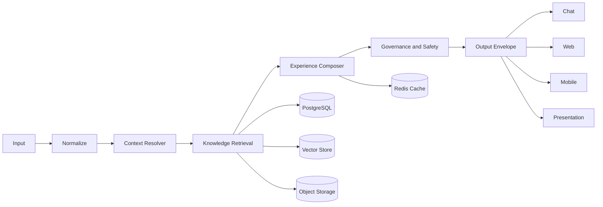

# BRAiN Realtime Experience Architecture

Status: Draft v0.1  
Scope: Erstes Arbeitsdokument fuer ein BRAiN-Fundament, das aus bestehendem Wissen in Echtzeit Chat-Antworten, Landingpages, Praesentationen, Erklaerseiten und mobile Ansichten erzeugen kann.  
Example concept: `Phyto Uckermark` als kontextbasierte, sichere, just-in-time generierte Wissens- und Erklaeroberflaeche.

## 1. Ziel

BRAiN soll nicht primaer statische Webseiten speichern.

BRAiN soll aus Input, Kontext, Wissen und Governance im Moment der Anfrage eine passende Experience erzeugen.

Eine Quelle, mehrere Ausgabeformen:
- Chat-Antwort
- Landingpage
- Praesentation
- Erklaerseite fuer Kunde X
- mobile Ansicht
- spaeter WebApp- und Native-App-Ansichten

Kernfluss:

`Input -> Context -> Retrieve -> Compose -> Validate -> Render -> Persist what matters`

## 2. Ist-Zustand

### 2.1 Was bereits vorhanden ist

- `SkillRun` ist der kanonische Execution Record in `backend/app/modules/skill_engine/`.
- `Mission -> SkillRun -> TaskLease` ist als kanonische Runtime-Form in `DESIGN.md` festgelegt.
- `task_queue` bildet Queue-, Retry-, Status- und externe Worker-Anbindung ab.
- `axe_streams` liefert bereits SSE-basierte Live-Events fuer Run-Status und Token-Streaming.
- `knowledge_engine` bietet Ingest, semantische Suche, Links und Versionen.
- `knowledge_layer` beschreibt durable, governte Wissensobjekte.
- `AXE UI` ist bereits eine produktive Chat- und Interaktionsoberflaeche.
- `ControlDeck v3` ist eine operative und governte Admin-/Ops-Oberflaeche.

### 2.2 Was bereits teilweise vorhanden ist, aber noch nicht kanonisch verbunden ist

- URL- und Dokument-Ingest existieren ueber `knowledge_engine`.
- Datei-Uploads existieren in AXE, werden aber aktuell lokal in Dateipfaden abgelegt.
- semantische Suche existiert ueber Qdrant oder JSON-Fallback.
- explizite Wissenslinks existieren ueber `knowledge_links`.
- Frontends koennen bereits Live-Zustaende abonnieren.

### 2.3 Aktuelle Schwaechen

- Kein systemweit kanonischer `InputEnvelope`.
- Kein systemweit kanonischer `OutputEnvelope`.
- Kein kanonischer `ExperiencePayload` fuer Web, Mobile, Deck, Chat.
- Kein expliziter Composition-Layer zwischen Wissen und Ausgabe.
- `webgenesis` ist statisch/deploy-orientiert und bereits als zu deprecaten markiert, daher kein tragfaehiger Zielpfad fuer JiT-Experiences.
- Dateiquellen und Medien liegen heute teils lokal im Filesystem statt hinter einer sauberen Object-Storage-Abstraktion.
- `knowledge_graph`, `knowledge_layer` und `knowledge_engine` sind noch nicht als eine klare Wissensarchitektur mit eindeutigen Rollen konsolidiert.

## 3. Soll-Zustand

### 3.1 Architekturprinzip

BRAiN speichert Wissen, Regeln, Quellen und UI-Bausteine.

BRAiN speichert nicht fuer jeden Sachverhalt eine fertige Webseite.

Die konkrete Experience wird pro Anfrage erzeugt.

### 3.2 Kanonische Schichten

#### Input Layer

Alle Eingaben werden in ein gemeinsames Format normalisiert.

```json
{
  "type": "text|voice|image|file|url|event|api",
  "source": "user|system|agent",
  "content": {},
  "metadata": {},
  "context": {}
}
```

#### Knowledge Layer

- `PostgreSQL`: Systemdaten, Metadaten, Links, Versionen, Audit, Progress
- `Redis`: Runtime-State, Cache, Queue-Hilfszustand, Session-Kontext
- `Vector Store`: semantische Suche und Retrieval
- `Object Storage`: PDFs, Bilder, Videos, Dokumente, Artefakte
- `Knowledge Links`: explizite Beziehungen zwischen Wissenseinheiten

#### Composition Layer

Diese Schicht baut aus Input und Wissen eine konkrete Experience.

Sie verantwortet:
- Kontextaufloesung
- Retrieval
- Ranking
- Filterung nach Rolle, Kunde, Geraet, Zeit, Region, Ziel
- Zusammenstellung der Experience-Sektionen
- Verdichtung auf die passende Ausgabetiefe

#### Output Layer

Jede Ausgabeform wird auf einen gemeinsamen Vertrag abgebildet.

```json
{
  "type": "answer|ui|presentation|action|artifact|event",
  "target": "chat|web|mobile|admin|system",
  "payload": {},
  "metadata": {}
}
```

#### Render Layer

Web- und App-Oberflaechen erhalten keinen seitenzentrierten Content, sondern einen renderbaren Experience-Payload.

```json
{
  "experience_type": "landingpage",
  "variant": "customer_explainer",
  "context": {
    "customer_id": "kunde-x",
    "device": "mobile"
  },
  "sections": [
    { "component": "hero_card", "data_ref": "summary" },
    { "component": "facts_list", "data_ref": "facts" },
    { "component": "cta_block", "data_ref": "next_step" }
  ],
  "safety": {
    "mode": "strict",
    "warnings": []
  },
  "cache": {
    "ttl_seconds": 1800,
    "persist": false
  }
}
```

## 4. Zielbild fuer Experience-Typen

Dieselbe Wissensbasis soll mehrere Experience-Typen bedienen koennen:
- `chat_answer`
- `landingpage`
- `presentation`
- `customer_explainer`
- `mobile_view`
- `app_screen`

Wichtig ist nicht ein eigener Datenpfad pro Kanal, sondern ein gemeinsamer Kern mit mehreren Render-Adaptern.

## 5. Beispiel Phyto Uckermark

Beispielanfrage:
- Input: Pflanzenbild
- Kontext: Uckermark, Ende Maerz, Beginner
- Ziel: einfache, sichere Erklaerung

Erwartete Ausgabeformen aus derselben Wissensbasis:
- Chat: kurze Antwort mit Warnhinweis
- Web: Erklaerseite mit Bild, Kurzprofil, Anleitung, Warnung
- Mobile: reduzierte Schritt-fuer-Schritt-Ansicht
- Praesentation: 3 bis 5 Folien fuer Partner oder Kunden

## 6. GAP

### 6.1 Pflicht-Gaps

- Einfuehrung eines kanonischen `InputEnvelope`
- Einfuehrung eines kanonischen `OutputEnvelope`
- Einfuehrung eines kanonischen `ExperienceRequest`
- Einfuehrung eines kanonischen `ExperiencePayload`
- Einfuehrung eines zentralen `experience_composer` oder gleichwertigen Composition-Services

### 6.2 Wichtige Gaps

- Klare Rollenabgrenzung zwischen `knowledge_engine`, `knowledge_layer` und `knowledge_graph`
- Abstraktion fuer Object Storage statt direkter lokaler Dateipfade
- feste Bibliothek an UI-Atomen und Section-Typen fuer Web und Mobile
- Regeln fuer Cache, TTL, Persistenz und Purge
- Governance-Regeln fuer Experience-Ausgabe, nicht nur fuer Skill-Ausfuehrung

### 6.3 Optionale Gaps

- Streaming einzelner Experience-Sektionen
- Live-Refresh bei Wissensaenderungen oder laengeren Agentenlaeufen
- Praesentations-spezifische Templates und Narrativ-Modi

## 7. Phase 1 MVP

### 7.1 Ziel

Ein erster produktiver Pfad fuer:
- `Sachverhalt -> Landingpage`
- `Sachverhalt -> Erklaerseite fuer Kunde X`
- `Sachverhalt -> mobile Ansicht`
- `Sachverhalt -> Chat-Antwort`

### 7.2 Minimaler Scope

- Neuer API-Einstieg: `POST /api/experiences/render`
- Eingabe: `ExperienceRequest`
- Ausgabe: `OutputEnvelope` mit `type=ui` oder `type=answer`
- Quelle: vorhandenes Wissen aus `knowledge_engine` plus kontextbezogene Metadaten
- Rendering: AXE UI oder spaeter dedizierte Experience-Frontendflaeche rendert `sections[]`

### 7.3 Minimaler Request-Vertrag

```json
{
  "intent": "explain|present|sell|summarize",
  "experience_type": "landingpage|customer_explainer|mobile_view|chat_answer",
  "subject": {
    "type": "topic|document|entity|case",
    "id": "optional",
    "query": "optional"
  },
  "audience": {
    "type": "customer|partner|internal|public",
    "id": "optional"
  },
  "context": {
    "device": "web|mobile|chat",
    "locale": "de-DE"
  }
}
```

### 7.4 Minimaler Build-Plan

1. Contracts definieren.
2. `experience_composer` als neuen Backend-Service anlegen.
3. `knowledge_engine` als erste Wissensquelle anbinden.
4. kleines Set an Section-Typen definieren.
5. ein Frontend rendert `sections[]` kontrolliert.
6. Audit und Governance fuer Experience-Render einfuehren.

## 8. Nicht-Ziele in Phase 1

- kein vollstaendig freies KI-generiertes Frontend ohne feste UI-Bausteine
- kein Ersatz des bestehenden `SkillRun`-Runtimes
- kein neuer paralleler Governance- oder Learning-Stack
- kein Zwang zu Neo4j, Kafka oder komplexer Enterprise-Infrastruktur
- kein Rueckgriff auf den alten statischen `webgenesis`-Pfad als Zielarchitektur

## 9. Architekturdiagramm



## 10. Naechste Entscheidung

Die naechste harte Architekturentscheidung ist nicht Frontend-Design, sondern die Festlegung der vier kanonischen Vertrage:
- `InputEnvelope`
- `OutputEnvelope`
- `ExperienceRequest`
- `ExperiencePayload`

Wenn diese vier Vertraege stabil sind, kann BRAiN dieselbe Wissensbasis fuer Chat, Web, Mobile und Praesentation verwenden.
